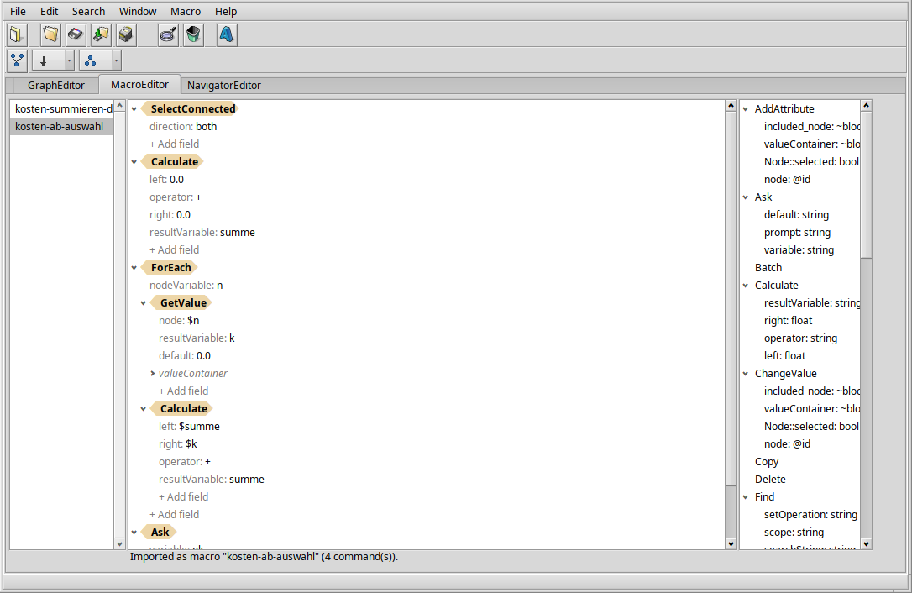
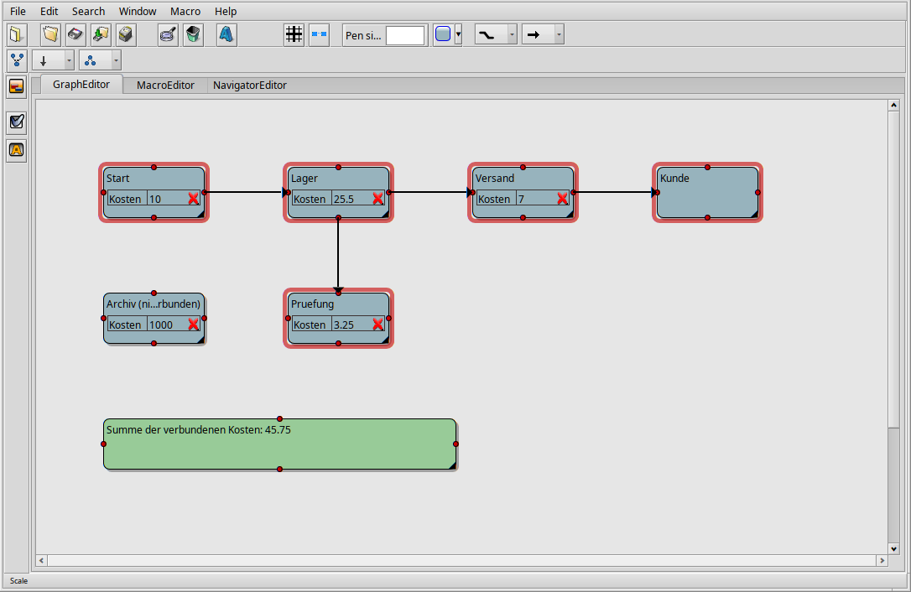

# ProjectConceptor - Macros

A macro is a list of commands - insert nodes, select, move, change an
attribute, lay out the graph, ... - that ProjectConceptor plays back on
the current document. Macros can be recorded while you work, built and
edited in the **MacroEditor** tab, and use loops, conditions and
variables. They are saved with the document and can be exported to a
text file.



- [Quick start](#quick-start)
- [The Macro menu](#the-macro-menu)
- [The MacroEditor tab](#the-macroeditor-tab)
- [Recording](#recording)
- [Playing](#playing)
- [Variables](#variables)
- [Loops and conditions](#loops-and-conditions)
- [Command reference](#command-reference)
- [Examples](#examples)
- [Macro files](#macro-files)
- [Keyboard shortcuts for macros](#keyboard-shortcuts-for-macros)
- [When something goes wrong](#when-something-goes-wrong)
- [Limitations](#limitations)

## Quick start

**Record one:** choose **Macro > Start recording**, do your edits in
the graph, choose **Macro > Stop recording** and give the macro a name.
It now appears under **Macro > Play**.

**Build one:** choose **Macro > New**, switch to the **MacroEditor**
tab and drag commands from the list on the right into the tree in the
middle. Click a value to change it. Play it with **Macro > Play**.

## The Macro menu

| Item | What it does |
|---|---|
| Start recording / Stop recording | Records every edit in between as a new macro; you're asked for a name when you stop. |
| Play | Lists this document's macros - choose one to play it. |
| New | Creates an empty macro to build in the MacroEditor tab. |
| Open | Imports a macro from a text file (see [Macro files](#macro-files)). A macro with the same name is replaced. |
| Save | Exports the macro selected in the MacroEditor tab to a text file. |
| Rename / Duplicate / Delete | Act on the macro selected in the MacroEditor tab. Delete asks first and can't be undone. |

Macros belong to the document: they are saved with it and are there
again when you open it.

## The MacroEditor tab

The tab has three parts: the document's **macros** on the left, the
selected macro as a **tree** in the middle, and a **reference of all
commands** with their fields on the right. Hover a command in the
reference to see what it does.

In the tree, each command is a tan, arrow-shaped label; its fields are
the lines below it (`name: value`). Commands that contain other
commands - **Repeat**, **ForEach**, **If** and **Batch** - show those
indented below their own fields. Nodes and connections that a command
creates appear as blue, rounded chips; expand one to see and edit the
node's data. Plain nested data (such as `valueContainer`) appears in
grey italics.

**Changing a value:** click the value. A text field opens right on it;
press Enter to keep the change or Esc to discard it. Text needs no
quotes. A true/false value toggles with a single click. If what you
typed doesn't fit the field (letters in a number field, say), the
status line says so and the old value stays.

**Adding a field:** click **+ Add field** below a command; the menu
lists that command's fields. Fields that can repeat (like Select's
`node`) stay in the menu after you've added them once. Inside nested
data you can add a field of any type under a name of your choice.

**Adding a command:** drag it from the reference on the right into the
tree. Drop it on the upper or lower half of a row to place it before or
after that command; drop it on a Repeat, ForEach, If or Batch to add it
as that command's last step.

**Moving commands:** drag a command - or several selected ones - to its
new place, with the same drop rules. Right-click a row for **Move Up**
and **Move Down**.

**Deleting:** select one or more rows (Shift/Ctrl for several) and press
Delete, or right-click and choose **Delete**.

**Pointing a command at a node:** commands such as Select, Group or
ChangeValue take a `node` field. A node created by an earlier Insert
in the same macro is written `@1`, `@2`, ... - the number in that
Insert's own `node` field. Instead of typing it, drag the node's chip
onto the command's row (adds a `node` field) or onto an existing `node`
field (replaces it).

**Expand All / Collapse All:** right-click any row, or an empty spot in
the tree.

## Recording

While recording, every command you carry out is added to the new macro,
in order. Edits you make to the node you just selected - renaming it
inline, changing an attribute, its color - are recorded as "the selected
node(s)" rather than "this exact node", so the macro also works on
other nodes and in other documents. Inserting new nodes records the
complete node, so playing the macro creates it again.

## Playing

Choose the macro under **Macro > Play**, or press its shortcut (see
below). The graph updates after each step. When the macro has finished,
the status line in the MacroEditor tab reports the result, for example
"Played 6 command(s).".

If something didn't work, an alert says what - the first problem and
how many there were (see [When something goes wrong](#when-something-goes-wrong)).
A macro never quietly continues with a made-up value.

Each top-level command of the macro is one step in **Edit > Undo**. A
Repeat, ForEach, If or Batch is undone as a whole.

## Variables

Variables carry values from one command to a later one while a macro
plays. They exist only during that one playback.

These commands put a value into a variable:

| Command | Variable | Value |
|---|---|---|
| Repeat | `counterVariable` | the pass number, starting at 0 |
| ForEach | `nodeVariable` | the node of the current pass |
| Insert | `resultVariable` | the node(s) just inserted |
| Remember | `variable` | the current selection |
| Calculate | `resultVariable` | the result of the calculation |
| GetValue | `resultVariable` | an attribute of a node |
| Ask | `variable` | the text you typed into a dialog |

There are two ways to use a variable:

**A whole field: `$name`.** Write `$` and the variable's name as the
field's value - `dx=$offset`, `node=$cell`. The field gets the
variable's value when the command runs. This works for any field of a
command itself, not inside nested data like `valueContainer`.

**Inside text: `${name}`.** In any text value - a node's name, an
attribute's value, an Ask prompt, nested data included - `${name}` is
replaced by the variable's value: `"Row ${row}, column ${col}"`. Whole
numbers appear without decimals (`3`, not `3.000000`). Write `$${` for
a literal `${`.

**Numbers and text:** text in a number field is converted - `12.5` and
`12,5` both work. Text that isn't a number is an error, not 0. `1.000,5`
(dot and comma together) is an error too, because it's ambiguous.

Loop counters start at 0. For a count starting at 1, add a step before:

```
Calculate
  left=$i
  operator="+"
  right=1.0
  resultVariable="number"
```

## Loops and conditions

- **Repeat** runs its steps `count` times.
- **ForEach** runs its steps once for every node that is selected when
  it starts.
- **If** runs its steps only if a search for `searchString` finds
  something - the same search as Find, but it doesn't change the
  selection.
- **Batch** groups its steps into one undo step.
- **Sleep** pauses for `milliseconds` - useful to watch a long macro.

These can be nested: a Repeat inside a Repeat walks rows and columns.

**SelectConnected** works like a loop over the graph: it adds every
node reachable from the selection over connections, following
`direction` (`both`, `outgoing` or `incoming`) for `depth` steps (`0`
means until nothing new is found). Combined with ForEach and GetValue
it can, for example, add up an attribute over everything connected to
a node.

## Command reference

Fields marked *optional* can be left out.

| Command | Fields | What it does |
|---|---|---|
| AddAttribute | `node` or `Node::selected=true`; `valueContainer` (`name`, `subgroup`, `type`, `newAttribute`) | Adds an attribute to the node(s). |
| Ask | `variable`; *optional* `prompt`, `default` | Shows a dialog and stores the answer as text. |
| Batch | - | Runs its steps as one undo step. |
| Calculate | `left`, `operator`, `right`, `resultVariable` | `+ - * / mod min max` combine `left` and `right`; `round floor ceil abs` use only `left`. |
| ChangeValue | `node` or `Node::selected=true`; `valueContainer` (`name`, `subgroup`, `type`, `newValue`) | Changes one field of the node(s). |
| Find | `searchString`; *optional* `scope` (`nodes`, `connections`, `both`), `setOperation` (`replace`, `add`, `subtract`, `intersect`) | Selects what contains the text, combined with the current selection as set by `setOperation`. |
| ForEach | *optional* `nodeVariable` | Runs its steps once per selected node. |
| GetValue | `node`, `valueContainer` (`name`, `subgroup`), `resultVariable`; *optional* `default` | Reads an attribute of the node into a variable. Missing attribute: `default` if given, otherwise an error. |
| Group | `node`; *optional* `deselect` | Groups the selection under the given group node. |
| If | `searchString`; *optional* `scope` | Runs its steps only if the search finds something. |
| Insert | `node` (with the node's data); *optional* `resultVariable` | Inserts nodes and connections. |
| Layout | *optional* `direction` (`TB`, `LR`, ...), `engine` (`dot`, `neato`, `fdp`, `sfdp`, `circo`, `twopi`) | Automatic layout of the whole graph. |
| Move | `dx`, `dy` | Moves the selection. |
| Remember | `variable` | Stores the selection; restore it with `Select` and `node=$variable`. |
| RemoveAttribute | `node` or `Node::selected=true`; `valueContainer` (`name`, `subgroup`, `index`) | Removes an attribute from the node(s). |
| Repeat | `count`; *optional* `counterVariable` | Runs its steps `count` times. |
| Select | *one of* `node`, `frame`, `selectAll=true`; *optional* `deselect` | Selects nodes. Clears the previous selection first, unless `deselect=false`. |
| SelectConnected | *optional* `direction`, `depth` | Adds everything connected to the selection. |
| Sleep | `milliseconds` | Pauses playback. |

Copy, Delete, Paste and Resize can be recorded and played, but their
fields can't be edited in the tree or in a macro file.

**Attributes** you add with the toolbar live in the node's `Node::Data`.
To read or change one, use `name` = the attribute's name and
`subgroup="Node::Data"`.

## Examples

**Three nodes in a row, named with a counter:**

```
Repeat
  count=3
  counterVariable="i"
  Insert
    resultVariable="n"
    node=@1
    ~included_node
      this=1
      what=class
      Node::Frame=[100.0,100.0,200.0,160.0]
      ~Node::Data
        Node::name="Node ${i}"
  Calculate
    left=$i
    operator="*"
    right=130.0
    resultVariable="x"
  Select
    node=$n
  Move
    dx=$x
    dy=0.0
```

Every pass inserts a fresh copy of the node at the same spot, so the
Move pushes pass number `i` by `i` x 130 pixels to the right.

A node written by hand like this needs only a name and a frame; it gets
the default font and colors. Recorded and dragged-in Inserts bring
their complete look.

**Add up "Costs" over everything connected to the selected node** -
select a node first:

```
SelectConnected
  direction="both"
Calculate
  left=0.0
  operator="+"
  right=0.0
  resultVariable="sum"
ForEach
  nodeVariable="n"
  GetValue
    node=$n
    ~valueContainer
      name="Costs"
      subgroup="Node::Data"
    resultVariable="c"
    default=0.0
  Calculate
    left=$sum
    operator="+"
    right=$c
    resultVariable="sum"
Ask
  variable="ok"
  prompt="Sum:"
  default="${sum}"
```



Ready-to-import versions of these and larger examples are in
`docs/fixtures/`, for instance `kosten-summieren-demo.txt` and
`rekursives-platzhalter-makro.txt`.

## Macro files

**Macro > Save** writes the selected macro as text, **Macro > Open**
reads one back; the file name becomes the macro's name. The format is
the one in the examples above:

- One command, field or nested block per line; indentation of two
  spaces per level shows what belongs to what.
- `name=value` sets a field. Values: `"text"` (with `\"` and `\\`),
  `true`/`false`, `12` (whole number), `1.5` (decimal), `(x,y)` (point),
  `[left,top,right,bottom]` (rectangle), `@1` (a node of this macro),
  `$name` (a variable).
- `~name` starts nested data; its fields follow one level deeper.
  Inside it, `what=class`, `what=group` or `what=connection` says what
  kind of object it is.
- Lines starting with `#` are comments.
- `raw:...` values preserve data that has no readable form; they're not
  meant to be written by hand.

Command and field names are checked when the file is read. An unknown
name, a value of the wrong kind or a wrong indentation is reported with
its line number, and nothing is imported.

## Keyboard shortcuts for macros

In **Edit > Project settings**, tab **Shortcuts**, the **Macro
shortcuts** list assigns a key combination to a macro name: click
**New...**, pick one of the current document's macros and press the
keys. Double-click an entry to change its keys. The shortcut plays the
macro of that name in whichever document you're working in, from then
on in all open windows.

## When something goes wrong

The alert after playback names the first problem. The most common ones:

| Message | Meaning |
|---|---|
| Command N (Name) failed. | That command couldn't run; playback stopped there. |
| N node reference(s) point to nodes the macro never creates | A `node=@id` refers to a node no Insert in this macro creates. |
| "$name" (for "field"): no such variable | The variable was never set - a typo, or it's set later in the macro. |
| "${name}": no such variable | The same for a placeholder in text. The text is left as written. |
| ... is "...", not a number | Text in a number field that isn't a number. |
| GetValue: node "..." has no attribute "..." | Add `default=0.0` if nodes without the attribute should count as 0. |
| The macro is empty - nothing to play. | |

## Limitations

- Inside a Repeat, ForEach or If, `@id` refers to the node as it was
  defined, not to the copy a pass inserts. Use `resultVariable` to work
  with a pass's own nodes.
- Connections inserted inside a Repeat are not re-created for each pass
  ([#139](https://github.com/Paradoxianer/ProjectConceptor/issues/139)).
- The graph is redrawn between top-level commands, not during a long
  single step - the passes of one Repeat appear together when it ends.
- A placeholder can't show a node (`${n}` for a ForEach node is an
  error); read one of its attributes with GetValue instead.
- The Ask dialog shows only a short prompt.
- Messages about errors in a macro file are in English.
