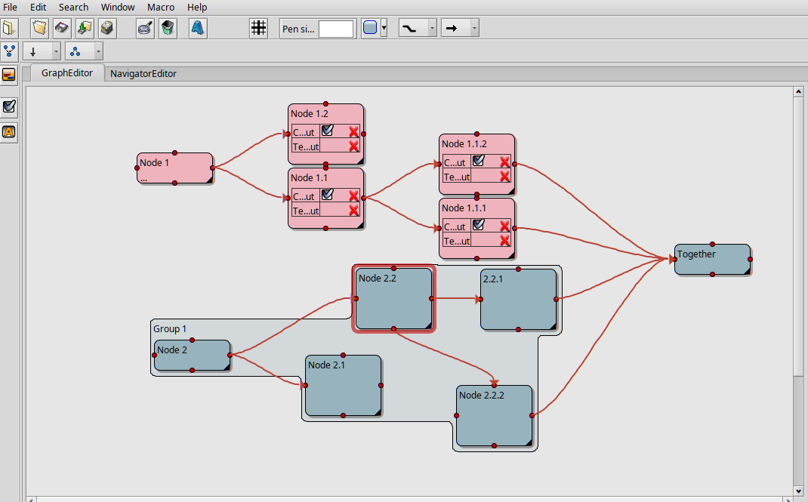
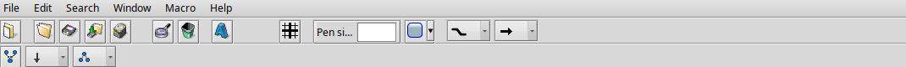
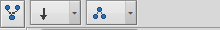
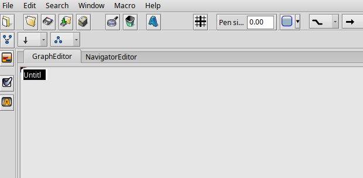
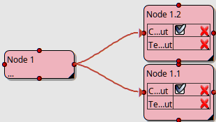
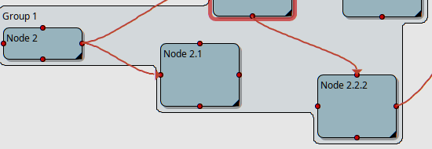
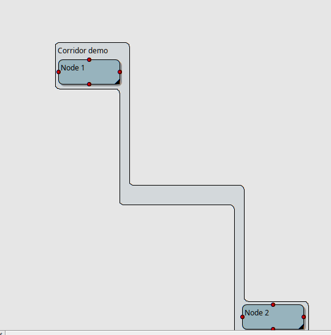

# ProjectConceptor - User Guide

ProjectConceptor is a graph editor for Haiku: nodes, attributes and
connections, groupable, with automatic layout. This document walks
through the main workflows using screenshots of a running instance.

## The toolbar

Left to right: file actions (New, Open, Save, Print), then edit/delete,
then three node tools (add a group, add a boolean attribute, add a text
attribute), grid toggle, pen size, fill color, and on the right two
icon choice fields:

- **Connection shape** - straight, rounded, or angular. Applies to
  whichever connections are currently selected.
- **Arrow ends** - arrowhead at the target, at the source, at both
  ends, or none.

Both show the currently picked shape as an icon; the pop-up menu also
carries the name, in case the icon alone isn't clear enough.

Below that, a second toolbar row, visible while the GraphEditor tab is
active:

- **Leftmost icon** - applies the automatic layout.
- **Direction** - which way the graph grows (top-to-bottom,
  left-to-right, etc.).
- **Topology** - the layout algorithm (hierarchical, circular,
  force-directed, ...).

## Creating a node

Double-clicking an empty spot in the GraphEditor creates a new node and
immediately puts its name into edit mode:

Type a name, done. Double-clicking *inside* an existing group instead
adds the new node as a child of that group directly.

## Attributes

Any node can carry its own attribute rows - added to the selected node
via the two toolbar icons ("add boolean attribute" / "add text
attribute"):

Each row has a checkmark icon (toggle the value) and a red cross
(remove the row).

## Connections

Dragging from one of a node's four red connection points to another
node creates a connection between them. Its shape and arrow ends can be
changed afterward via the toolbar icons above, as long as the
connection is selected (works on several at once).

## Grouping

Select several nodes, then click the group icon in the toolbar. The
group draws itself as one connected shape that hugs its children
tightly - even when they're different sizes or don't line up at the
same height:

The shape grows automatically as a child moves or a new one is added,
and shrinks back just as readily when a child is removed. Double-
clicking the group's own area adds a new child node to it directly (see
above).

A freshly created group defaults to just a faint tint with no drop
shadow - like any node, its fill color can be set to something solid
via the toolbar's fill color control.

If two children don't overlap vertically at all - one sitting entirely
above the other - the group connects them with a short, fixed-width
corridor instead of stretching a single shape across the gap:

## Automatic layout

The leftmost icon of the second toolbar row (see above) rearranges the
whole graph - useful after inserting many nodes by hand, which tend to
overlap. Direction and topology can be set first via the two fields
next to it.

## Save, load, undo

- **File → Save / Save As** writes the document to a `.pcd` file.
- **File → Open** loads an existing document.
- **Edit → Undo / Redo** covers every change - creating nodes, moving
  them, grouping, editing attributes, drawing connections.
- **Edit → Select all** selects the entire graph at once, e.g. to move
  all of it together.
